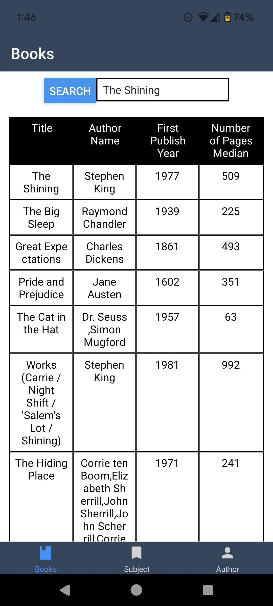

# BookSearch
A Book Search Mobile App for searching up books.



## Mobile App

To run the program using the following commands

Run for Android
```
npm run android
```

Run for IOS
```
npm run ios
```
**Note**: you need to use macOS to build the iOS project - use the Expo app if you need to do iOS development without a Mac

Run for Web
```
npm run web
```

## Backend Server

Create virtual environment
```
python3 -m venv venv
```

Activate virtual environment
```
. venv/bin/activate
```

Run the flask app after actviating the virtual environment
```
flask --app main run
```
## Connect to the Server

This explains how to get the Expo app on the **Android phone** to connect to the server on the **development machine**.

This method works if the following criteria are met:
1. Your device is running Android 5.0 (Lollipop) or newer,
2. USB debugging is enabled, and your device is connected to your development machine via USB.

Find the device name
```
adb devices
```

Expose the server port to the Android device.
```
adb -s <device name> reverse tcp:5000 tcp:5000
```

**Note**: The url `http://localhost:5000` should be accessible to the Android phone.

Go to `config.js` on mobile directory and make sure the `SERVER_IP_ADDRESS_FROM_EXPO_APP` is used for the `SERVER_URL`.

Example for `config.js`:
```
export const SERVER_URL = "http://" + SERVER_IP_ADDRESS_FROM_EXPO_APP + ":" + POR
```

## Resources
- [React Native - Running On Device](https://reactnative.dev/docs/running-on-device)
- [Flask - Installation](https://flask.palletsprojects.com/en/3.0.x/installation/)
- [Open Library - Developer Center / APIs](https://openlibrary.org/developers/api)

