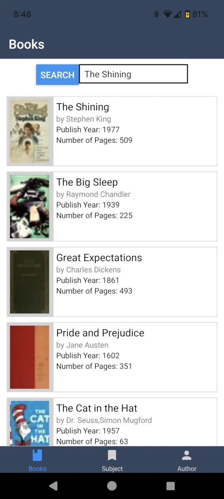

# BookSearch
[](https://github.com/sagedemage/BookSearch/actions/workflows/mobile_app.yml)
[](https://github.com/sagedemage/BookSearch/actions/workflows/backend.yml)



## Purpose
A book search mobile app for searching up books.

## Mobile App
To run the program using the following commands

Run for Android
```
npm run android
```

Run for IOS
```
npm run ios
```
**Note**: you need to use macOS to build the iOS project - use the Expo app if you need to do iOS development without a Mac

Run for Web
```
npm run web
```

## Backend Server
Create virtual environment
```
python3 -m venv venv
```

Activate virtual environment
```
. venv/bin/activate
```

Run the flask app after actviating the virtual environment
```
flask --app main run
```

## Connect to the Server
[Connect to the Server](./docs/connect_to_the_server.md)

## Resources
- React Native
    - [Running On Device](https://reactnative.dev/docs/running-on-device)
    - [Navigating Between Screens](https://reactnative.dev/docs/navigation)
    - [Networking](https://reactnative.dev/docs/network)
- [Flask - Installation](https://flask.palletsprojects.com/en/3.0.x/installation/)
- [Open Library - Developer Center / APIs](https://openlibrary.org/developers/api)

